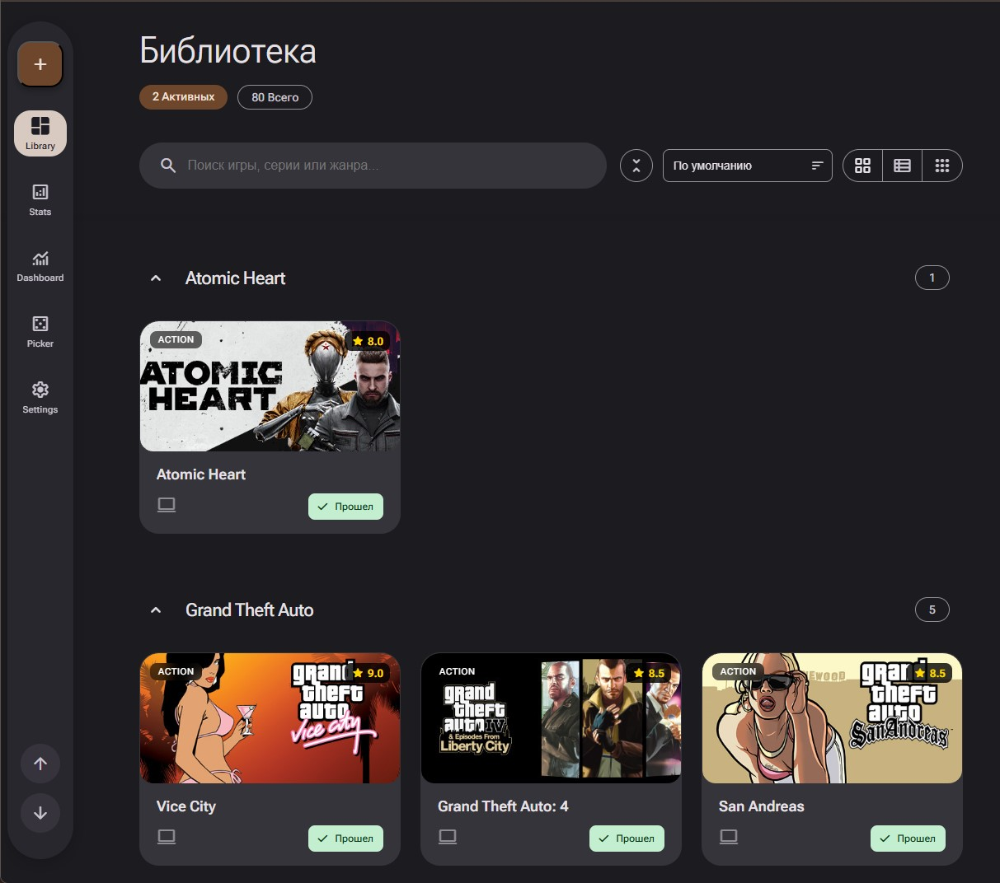
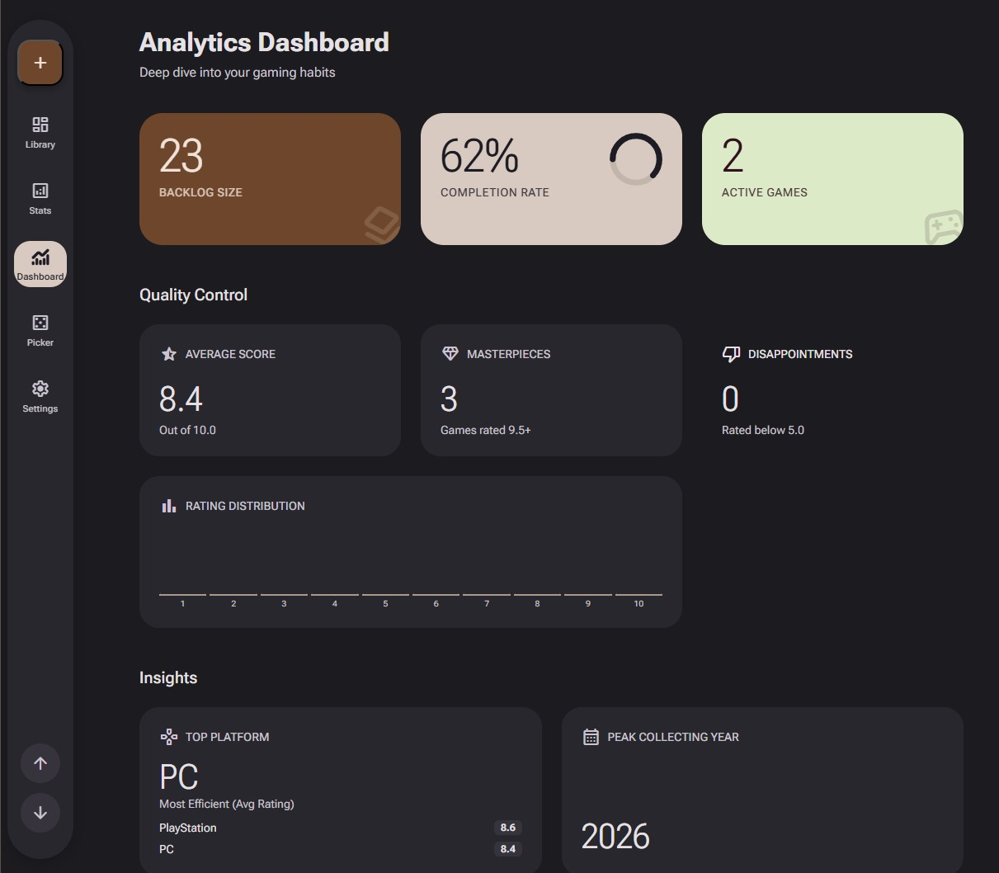
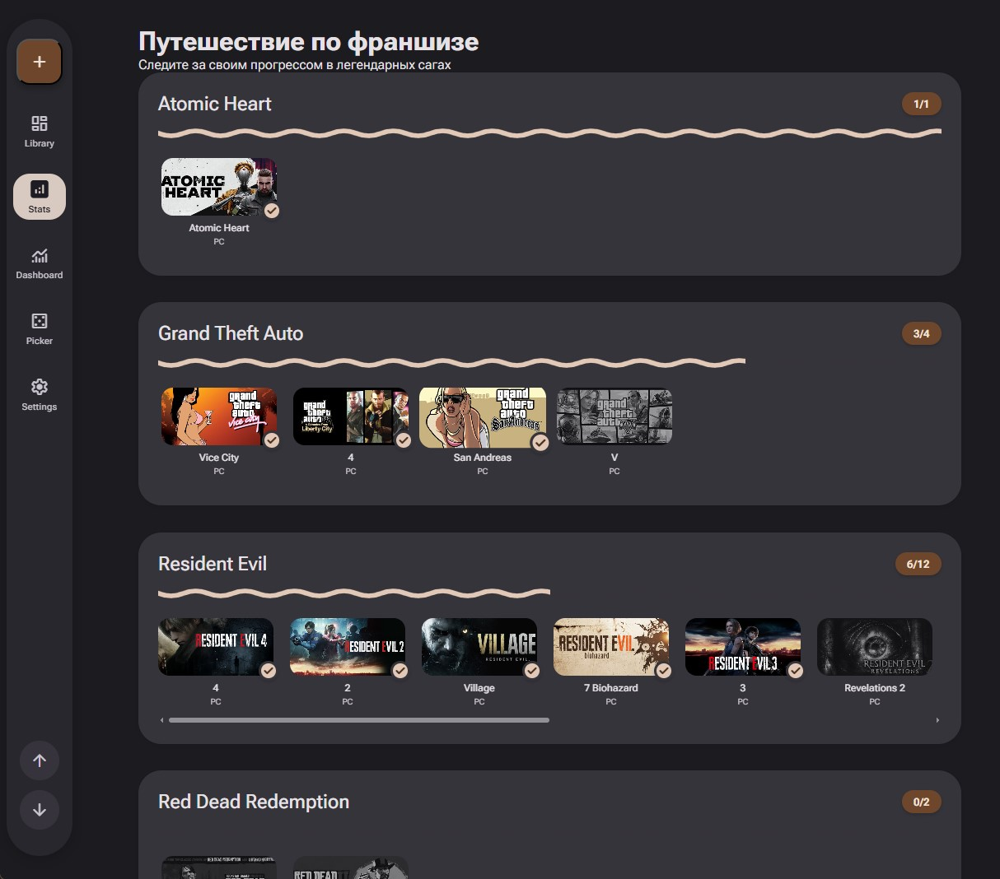
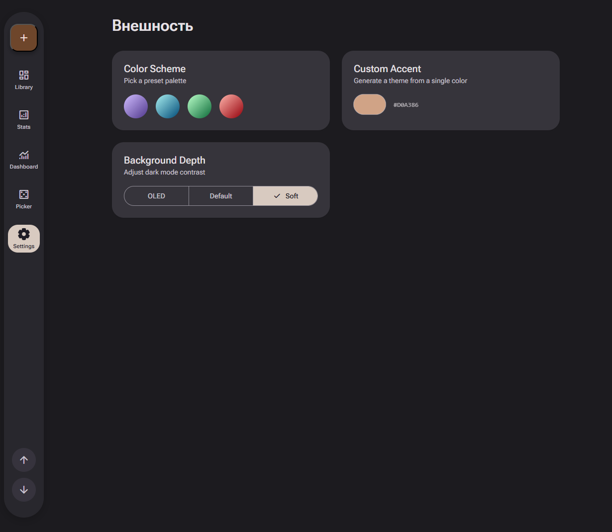
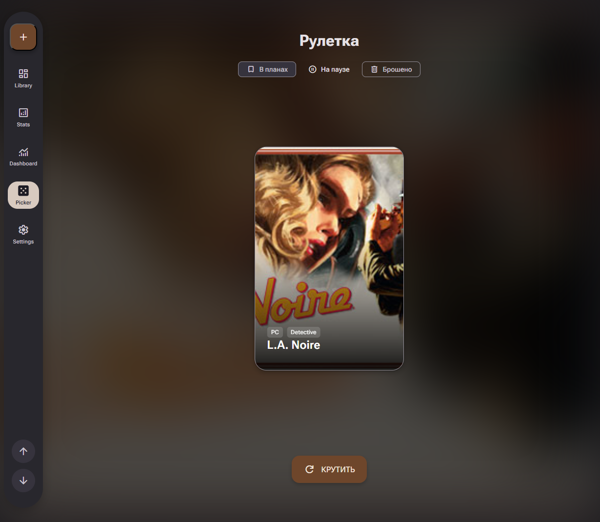

```markdown
<div align="center">

# Game Tracker

Персональная библиотека видеоигр с интерфейсом в стиле Material Design 3. Отслеживайте прогресс, группируйте игры по франшизам и просматривайте статистику прохождений.


</div>

---

## Скриншоты проекта

<p align="center">
  
  
</p>
<p align="center">
  
  
</p>
<p align="center">
  
</p>

---

## Возможности

*   **Библиотека** — карточки игр с обложками, рейтингами и статусами (Играю / Пройдено / На паузе / Брошено / В планах).
*   **Франшизы** — удобная группировка игр по сериям с использованием аккордеон-секций.
*   **Поиск и сортировка** — мгновенный поиск по названию или франшизе, сортировка по имени, рейтингу и текущему статусу.
*   **Три режима отображения** — классическая сетка, компактный список и расширенный вид.
*   **Статистика (Journey)** — наглядный дашборд вашего прогресса по франшизам.
*   **Темы оформления** — цветовые пресеты (Violet, Ocean, Emerald, Volcanic), возможность задать кастомный цвет, а также выбор фона (OLED / Default / Soft).
*   **Адаптивный дизайн** — полноценная поддержка десктопа (Navigation Rail) и мобильных устройств (Floating Island).

## Технологический стек

| Компонент | Технология |
|-----------|-----------|
| **Backend** | Python, Flask |
| **Frontend** | Jinja2, Vanilla JS |
| **Стили** | CSS (Material Design 3 Expressive) |
| **Шрифты** | Roboto Flex, Material Symbols Rounded |
| **База данных** | JSON (`data/games_data.json`) |

## Структура проекта

```text
game_tracker/
├── app.py                  # Flask-приложение, API-эндпоинты
├── requirements.txt        # Зависимости Python
├── data/
│   └── games_data.json     # База данных игр
├── static/
│   ├── css/                # Стили (базовые, библиотека, мобильные, настройки)
│   ├── img/                # Логотипы и графика
│   ├── js/                 # Логика работы UI, темы, CRUD-операции
│   └── screenshots/        # Скриншоты для README
└── templates/
    ├── base.html           # Базовый шаблон с навигацией
    ├── library.html        # Главная страница (библиотека)
    ├── journey.html        # Страница статистики
    └── settings.html       # Настройки внешнего вида
```

## Установка и запуск

1. Клонируйте репозиторий на локальную машину:
```bash
git clone https://github.com/<username>/game_tracker.git
cd game_tracker
```

2. Создайте и активируйте виртуальное окружение:
```bash
python -m venv .venv
# Для Windows:
.venv\Scripts\activate
# Для Linux/macOS:
source .venv/bin/activate
```

3. Установите необходимые зависимости:
```bash
pip install -r requirements.txt
```

4. Запустите приложение:
```bash
python app.py
```
*Приложение будет доступно в браузере по адресу: http://localhost:5000*

## API Эндпоинты

| Метод | Эндпоинт | Описание |
|-------|----------|----------|
| `GET` | `/` | Отрисовка библиотеки игр |
| `GET` | `/journey` | Отрисовка страницы статистики |
| `GET` | `/settings` | Отрисовка страницы настроек |
| `POST` | `/api/add` | Добавление новой игры в базу |
| `POST` | `/api/update` | Обновление данных существующей игры |
| `POST` | `/api/add-franchise` | Создание новой франшизы |
```
